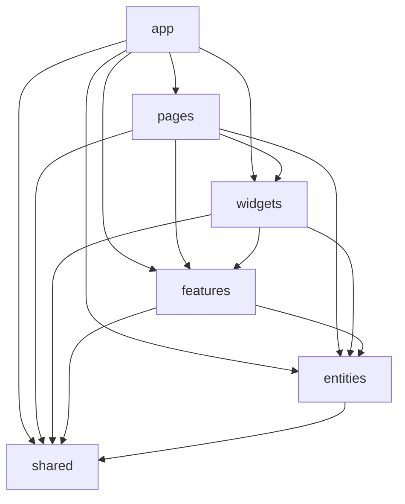

## Архітектура

Проєкт організовано за Feature-Sliced Design. Залежності спрямовані від верхніх
шарів до нижчих; нижчі шари не імпортують код із верхніх.

```mermaid
flowchart TD
    app --> pages
    app --> widgets
    app --> features
    app --> entities
    app --> shared

    pages --> widgets
    pages --> features
    pages --> entities
    pages --> shared

    widgets --> features
    widgets --> entities
    widgets --> shared

    features --> entities
    features --> shared

    entities --> shared
```
